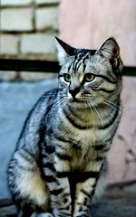
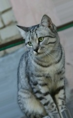

<h1>Data Augmentation</h1>

Package with data augmentation techiniques to apply to the dataset. Pass them as a list to the argument ***data_augm*** in the [`DataLoader()`](DataLoader.md) class. Follow the example below:


```python
from DeepExpressions.train_utils import DataLoader, data_augmentation as daug

daug_list = [
    daug.flip_left_right,
    daug.flip_up_down,
    daug.random_brightness,
    daug.random_contrast,
    daug.random_hue,
    daug.random_jpeg_quality,
    daug.random_rotation,
    daug.random_saturation,
    daug.random_shear,
    daug.random_zoom
]

dataset = DataLoader(data_root="...", data_augm=daug_list)
```


---
## flip_left_right

Flip an image horizontally (left to right).

```python
DeepExpressions.train_utils.flip_left_right(image, label: tuple)
```

 

<small>
<p>[This image](https://www.flickr.com/photos/malfet/1428198050) by [Nikita](https://www.flickr.com/photos/malfet/) is licensed under [CC-BY 2.0](https://creativecommons.org/licenses/by/2.0/)</p>
</small>


---
## flip_up_down

Flip an image vertically (upside down).

```python
DeepExpressions.train_utils.flip_up_down(image, label: tuple)
```

 

<small>
<p>[This image](https://www.flickr.com/photos/malfet/1428198050) by [Nikita](https://www.flickr.com/photos/malfet/) is licensed under [CC-BY 2.0](https://creativecommons.org/licenses/by/2.0/)</p>
</small>


---
## random_brightness

Adjust the brightness of images by a random factor.

```python
DeepExpressions.train_utils.random_brightness(image, label: tuple, max_delta=0.5)
```

> * **max_delta:** Amount to add to the pixel values.

 

<small>
<p>[This image](https://www.flickr.com/photos/malfet/1428198050) by [Nikita](https://www.flickr.com/photos/malfet/) is licensed under [CC-BY 2.0](https://creativecommons.org/licenses/by/2.0/)</p>
</small>


---
## random_contrast

Adjust the contrast of an image or images by a random factor.

```python
DeepExpressions.train_utils.random_contrast(image, label: tuple, lower=0.5, upper=2.5)
```

> * **lower:** Lower bound for the random contrast factor.
> * **upper:** Upper bound for the random contrast factor.

 

<small>
<p>[This image](https://www.flickr.com/photos/malfet/1428198050) by [Nikita](https://www.flickr.com/photos/malfet/) is licensed under [CC-BY 2.0](https://creativecommons.org/licenses/by/2.0/)</p>
</small>


---
## random_hue

Adjust the hue of RGB images by a random factor.

```python
DeepExpressions.train_utils.random_hue(image, label: tuple, max_delta=0.5)
```

> * **max_delta:** Maximum value for the random delta.

 

<small>
<p>[This image](https://www.flickr.com/photos/malfet/1428198050) by [Nikita](https://www.flickr.com/photos/malfet/) is licensed under [CC-BY 2.0](https://creativecommons.org/licenses/by/2.0/)</p>
</small>


---
## random_jpeg_quality

Randomly changes jpeg encoding quality for inducing jpeg noise.

```python
DeepExpressions.train_utils.random_jpeg_quality(image, label: tuple, min_jpeg_quality=5, max_jpeg_quality=25)
```

> * **min_jpeg_quality:** Minimum jpeg encoding quality to use.
> * **max_jpeg_quality:** Maximum jpeg encoding quality to use.

 

<small>
<p>[This image](https://www.flickr.com/photos/malfet/1428198050) by [Nikita](https://www.flickr.com/photos/malfet/) is licensed under [CC-BY 2.0](https://creativecommons.org/licenses/by/2.0/)</p>
</small>


---
## random_rotation

Performs a random rotation of a image.

```python
DeepExpressions.train_utils.random_rotation(image, label: tuple, angle=45)
```

> * **angle:** Rotation range, in degrees.

 

<small>
<p>[This image](https://www.flickr.com/photos/malfet/1428198050) by [Nikita](https://www.flickr.com/photos/malfet/) is licensed under [CC-BY 2.0](https://creativecommons.org/licenses/by/2.0/)</p>
</small>


---
## random_saturation

Adjust the saturation of RGB images by a random factor.

```python
DeepExpressions.train_utils.random_saturation(image, label: tuple, lower=0, upper=5)
```

> * **lower:** Lower bound for the random saturation factor.
> * **upper:** Upper bound for the random saturation factor.

 


<small>
<p>[This image](https://www.flickr.com/photos/malfet/1428198050) by [Nikita](https://www.flickr.com/photos/malfet/) is licensed under [CC-BY 2.0](https://creativecommons.org/licenses/by/2.0/)</p>
</small>


---
## random_shear

Performs a random spatial shear of a image.

```python
DeepExpressions.train_utils.random_shear(image, label: tuple, intensity=45)
```

> * **intensity:**  Transformation intensity in degrees.

 

<small>
<p>[This image](https://www.flickr.com/photos/malfet/1428198050) by [Nikita](https://www.flickr.com/photos/malfet/) is licensed under [CC-BY 2.0](https://creativecommons.org/licenses/by/2.0/)</p>
</small>


---
## random_zoom

Performs a random spatial zoom of a image.

```python
DeepExpressions.train_utils.random_zoom(image, label: tuple, zoom_range=(0.6, 0.6))
```

> * **zoom_range:** Zoom range for width and height.

 

<small>
<p>[This image](https://www.flickr.com/photos/malfet/1428198050) by [Nikita](https://www.flickr.com/photos/malfet/) is licensed under [CC-BY 2.0](https://creativecommons.org/licenses/by/2.0/)</p>
</small>
